
<link
  rel="stylesheet"
  href="https://cdn.jsdelivr.net/npm/img-comparison-slider@8/dist/styles.css"
/>

## Abstract

 
This work presents large, high-fidelity
 3D synthetic tomato field datasets and a data generator based on
 Unreal Engine 5. The framework incorporates a novel parameterized 
 texture overlay function and preprocessing models to adapt
 public tomato disease textures to generate diverse yet realistic 
 disease features within the simulation.
 Experimental results show that models trained on our synthetic
 dataset exhibit superior generalization to out-of-distribution real
world data, improving tomato disease detection by 2.54 IoU
 over PlantSeg, fruit detection by 7.36 IoU over ACOD-12K, and
 significantly improving stereo matching quality under low-light
 and dense plant canopy. With unsupervised domain adaptation,
 our dataset achieves performance comparable to manual labels

  

      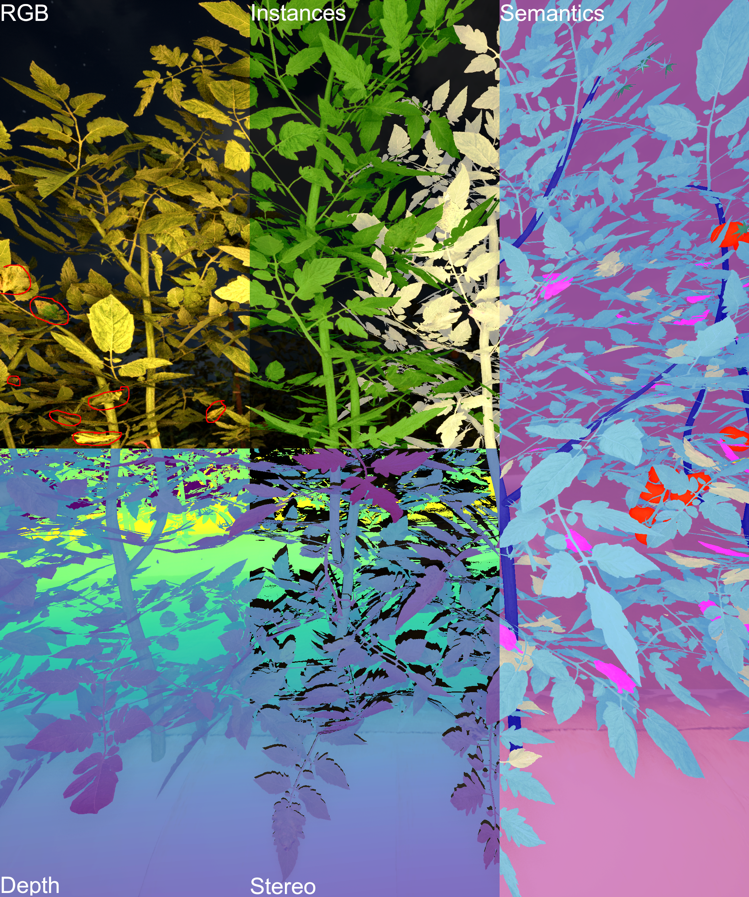

  

## Brief Background
Plant diseases cause significant global yield losses,
 estimated at around 20% for many crops. Early detection and
 continuous monitoring are critical for implementing timely crop
 protection practices to mitigate losses. Advances in agricultural
 robotics may enable high-throughput, autonomous field monitoring. 
 However, most existing disease datasets consist of close-up
 images collected under controlled conditions for manual diagnosis, 
 resulting in models to generalize poorly to robotic platforms
 with wider field imagery for high-throughput disease monitoring.

## Simulator
**Overview.** The simulator is built upon Unreal Engine 5 with ROSIntegration for synthetic image generation. The simulation environment consist of an outdoor tomato field and three robot models (Husky, Benchbot, and Spider). The tomato field can be augmented with real-world leaf disease textures with parameterized height distribution, disease types, and quantity of diseases. 

The most recent version of the simulator for Windows 11 is available at the top of the page. The following information follows the most recent simulator version, but the dataset may not include some of these options.

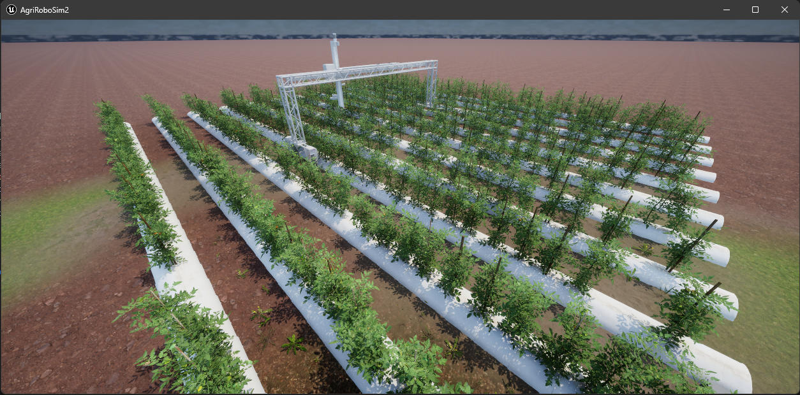

**Environment Parameters.** Aside from the obvious robot and tomato fields, the environment also includes the time-of-day and cloud systems. [**Details Page →**](./pages/Simulator/EnvParam.html).

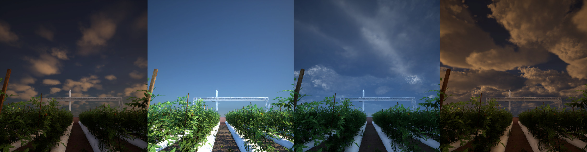

**Field Parameters.** The field contains the bulk of the configuration options for variations. In general it follows the row-crop configuration with adjustable field size and plant gaps in the GUI. Additionally, many disease spread options are also exposed in the GUI. [**Details Page →**](./pages/Simulator/FieldParam.html).

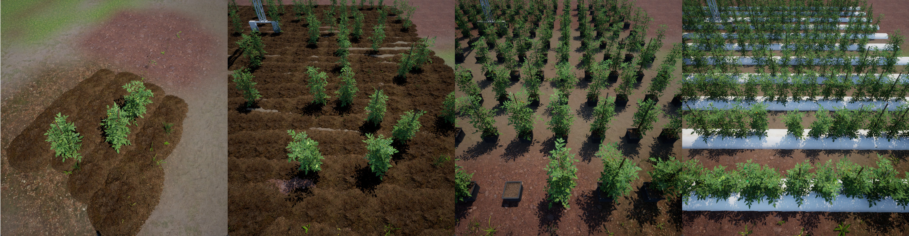

**Robot/Camera Parameters.** The most recent simulator have three robot versions, BenchBot, HuskyBot, and SpiderBot. The GUI exposes camera options such as the camera type, resolution, and capture rates. It also exposes the planar position of the robots in the field. The robots are controlled by position, as we do not intend to use the UE5 environment for physics simulations. [**Details Page →**](./pages/Simulator/RobotParam.html).

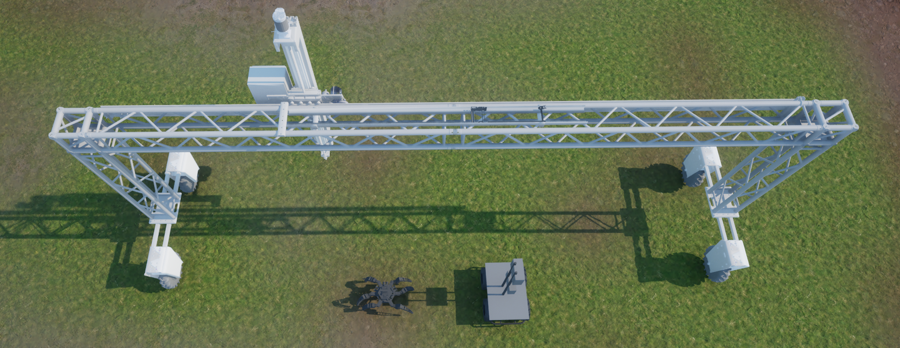

## Datasets

**TomatoGeneral.** TomatoGeneral is the larger and more varied dataset generated compared to TomatoCastle. The majority of the images have randomized perspectives and uses natural lighting with exposure changes, which are common features across real-world tomato datasets such as LaboroTomato, LeafAndTomato, and TomatOD. [**Details Page →**](./pages/Dataset/TG.html).

  <!-- LEFT = 70% -->
  

    
      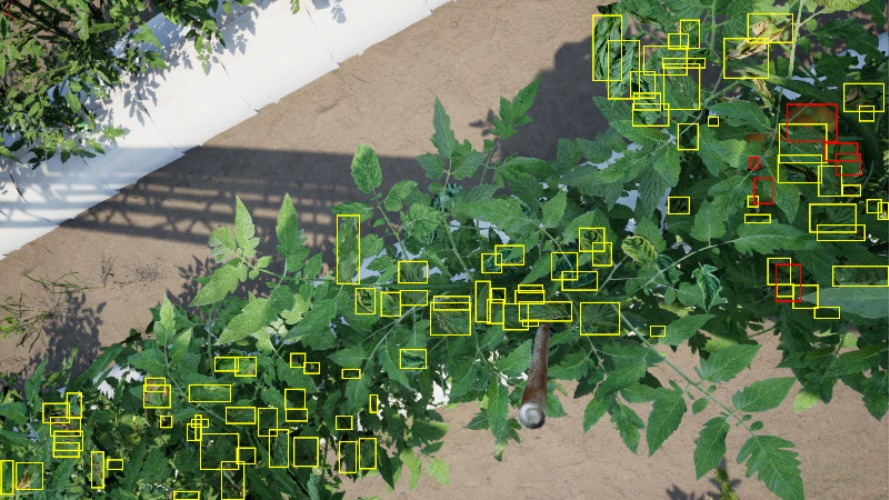
      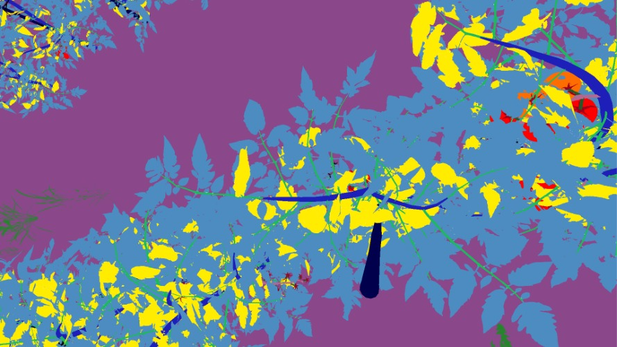
    </img-comparison-slider>
  

  <!-- RIGHT = 30% -->
  

    
      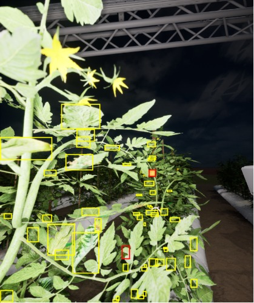
      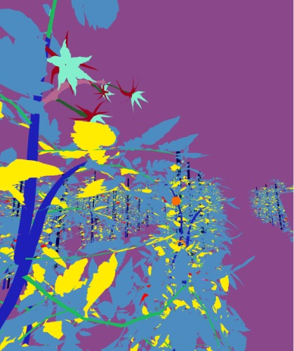
    </img-comparison-slider>
  

  <em>Slider for comparison.</em>

**TomatoCastle** TomatoCastle is a more targeted dataset for field robot application, where stereo was also included for stereo matching model training. [**Details Page →**](./pages/Dataset/TC.html).

  

    
      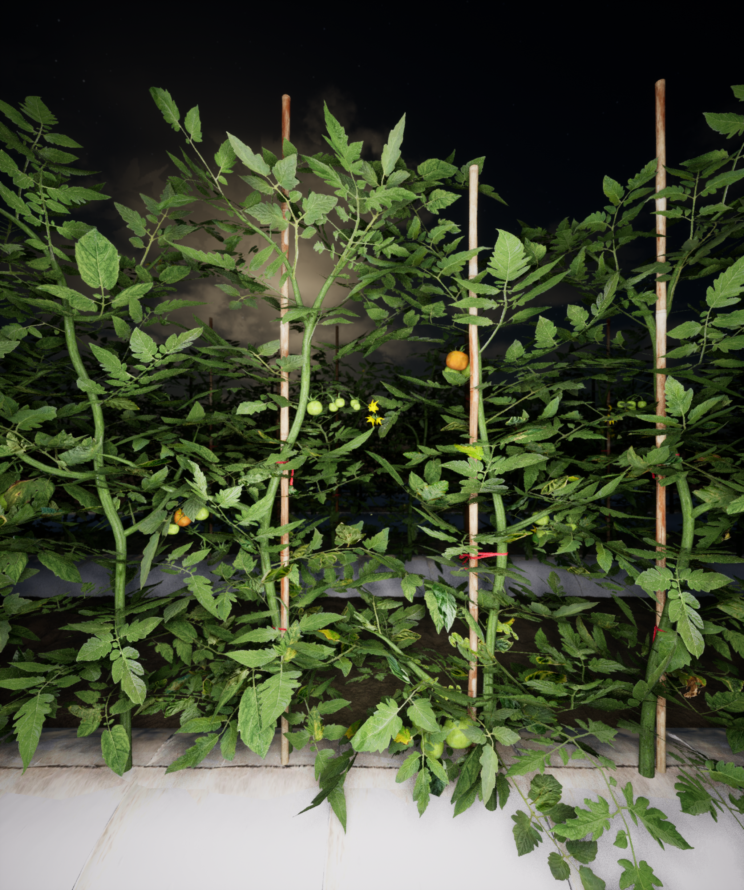
      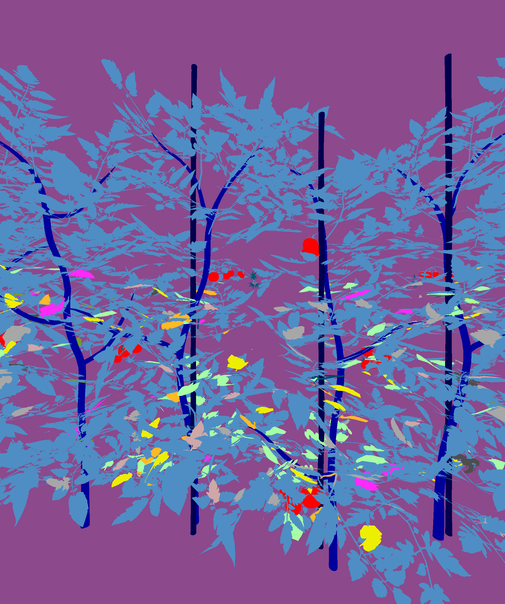
    </img-comparison-slider>
  

  <!-- RIGHT = 30% -->
  

    
      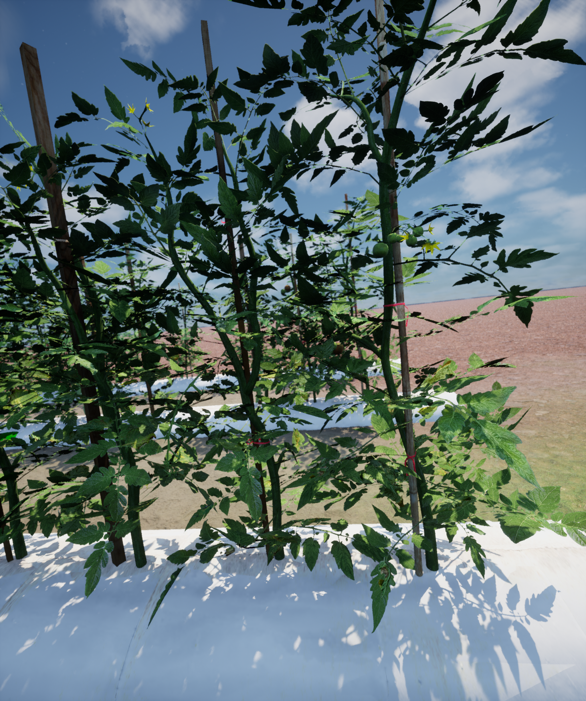
      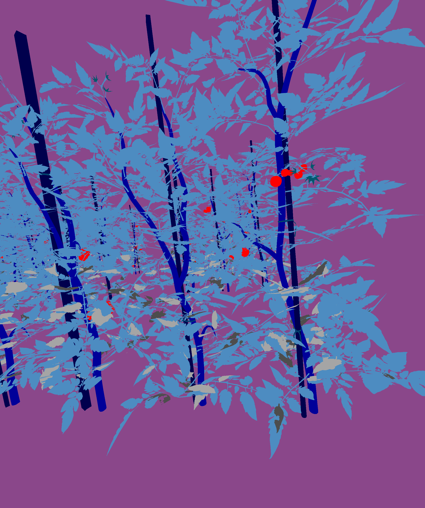
    </img-comparison-slider>
  

  <em>Slider for comparison.</em>

## Applications

**Public Datasets** In this work we used TomatoGeneral to benchmark out-of-distribution semantic segmentation on the public datasets and compare to the ACOD-12K dataset. [**Details Page →**](./pages/Applications/PublicDataset.html).

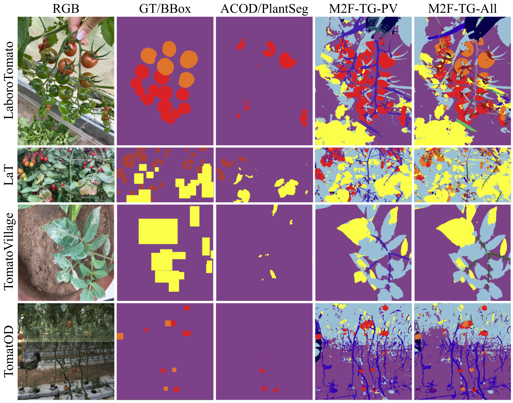

**Sim2Real** We also experiment the unsupervised domain adaptation methods on unlabeledd field images using TomatoCastle. [**Details Page →**](./pages/Applications/UDA.html)

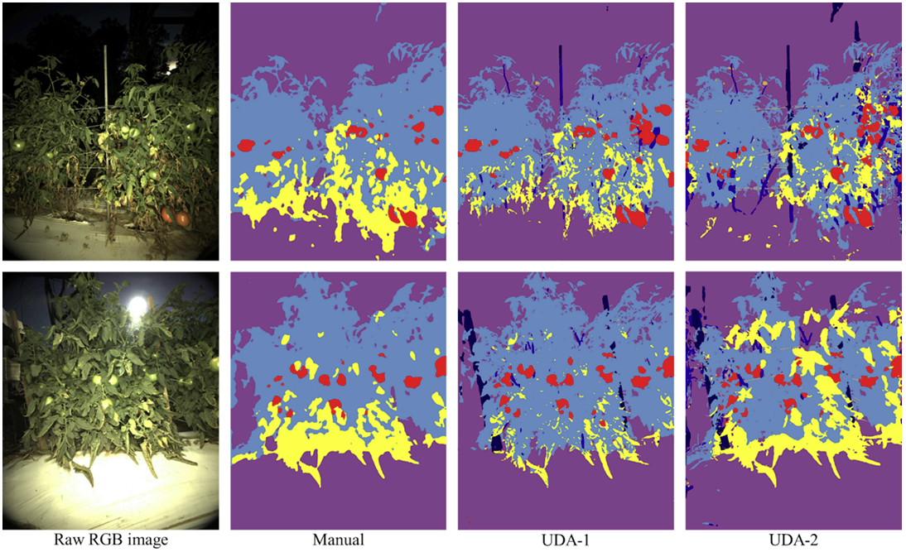

**Stereo Matching** PhenoStereo is a stereo camera designed for field imaging with low exposure time to reduce motion blur during movement. The camera module is equpped with multiple high intensity strobe lights to capture bright images with the low exposure options, it also helps with consistent image quality across different time-of-day. Although this type of imaging is not commonly found in stereo datasets, here we examine the performance of pretrained stereo model on other datasets to the synthetic dataset from TomatoCastle. [**Details Page →**](./pages/Applications/Stereo.html)

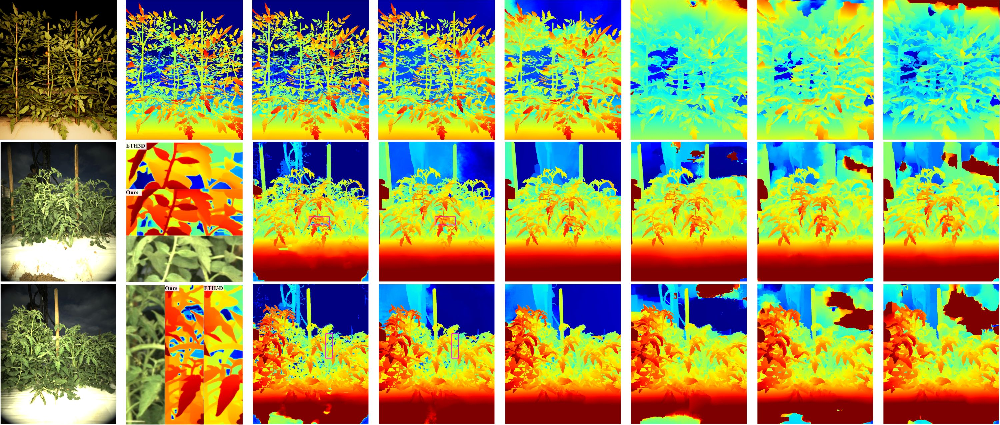

