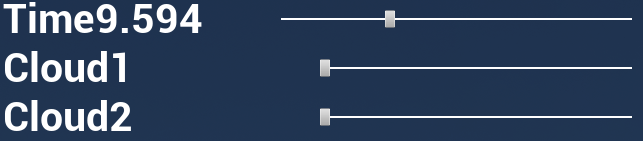

## [Back to Main](../../index.html)
## GUI Options

**Time - Slider** Adjust the time between 4:00-22:00, the date is set to (TODO: check)

**Cloud1 - Slider** General clouds, equal mix of various clouds.

**Cloud2 - Slider** Stormy clouds. Note: after about 1/3 the Cloud1 slider is disabled.

## ROS Options

**TimeIncr:\<hour\>** Increment the environment time by the amount of hours. Sending a negative value will set the time to 8:00.
