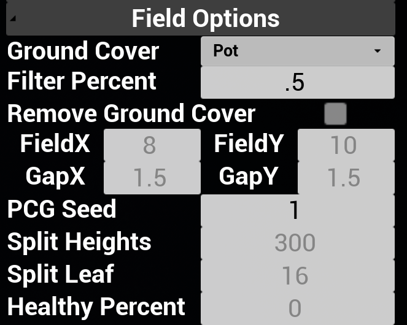
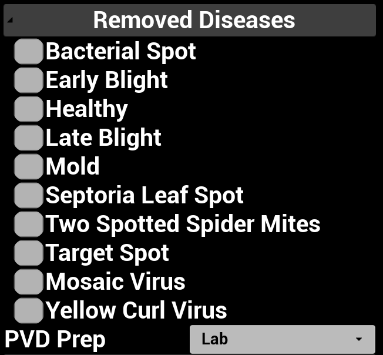

## [Back to Main](../../index.html)

## GUI Options (Field)

  

  <iframe style="width: 50%; aspect-ratio: 16/9;" src="https://www.youtube.com/embed/uzh7iAPh0Ls" title="field param vid" frameborder="0" allow="accelerometer; autoplay; clipboard-write; encrypted-media; gyroscope; picture-in-picture; web-share" referrerpolicy="strict-origin-when-cross-origin" allowfullscreen></iframe>

**GroundCover - Dropdown** Replaces what is under the tomatoes, currently four options: Pot, Plastic, Dirt, and Nothing.

**Filter Percent - [0-1]** Probability of each plant in the field to be empty (not spawned).

**Remove Ground Cover - Checkbox** If the ground cover should also be removed if the plant is not spawned.

**FieldX/Y - meter** Size of the entire field.

**GapX/Y - meter** Gap between the plants.

**PCG Seed - int** Randomization Seed for the field, best to set it again after changing above options.

**Split Heights - list<float(cm)>** Comma separated list for the number of disease sections for each plant. For example: `100,200` will produce three sections [:100 cm], (100 cm:200 cm], [200 cm:) corresponding to the `Split Leaf`.

**Split Leaf - list <int(number of leaves)>** Comma separated list for the number of disease sections for each plant. For example: `16,8` (in pair with the above example) will produce assign the three sections with 16 disease samples, 8 disease samples, and 0 disease samples.

**Healthy Percent - [0-1]** Probability that the plant will be healthy (overrides above options).

## GUI Options (Disease Types)

**Disease name - Checkbox** Check if the disease should be removed from the environment. Does not apply the PlantSeg sources.

**PVD Prep - Dropdown** Originally for the preprocessing method for the disease textures (to appear more natural to the plant model). It also provides PlantSeg as a disease texture source, in our experiments it did not perform as well as the PlantVillage ones.

## ROS Options

**DiseaseFilter:\<disease_ids\>** See Disease name in GUI, the disease_ids are 0-10, only applies to PlantVillage sourced textures.

**SplitHeightLeaf:\<height_1,leaf_1,height_2,leaf_2,...\>** See Split Heights and Split Leaf in GUI.

**LeafPreprocess:\<heights\>** See PVD Prep in GUI.

**PercentHealthy:\<percent\>** Probability that the plant will be healthy.

**PCGSeedIncr:\<increments\>** Increment the random seed by `increment` and refresh the scene, add this at the end to apply previous options.