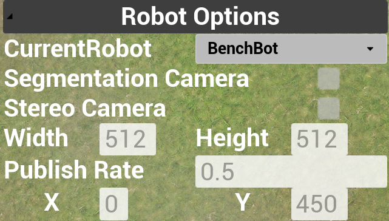
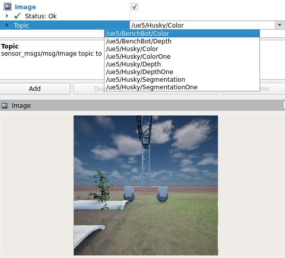

## [Back to Main](../../index.html)
## GUI Options

  
    

**CurrentRobot - Dropdown** Select which robot the following options should be applied to.

**Segmentation Camera - Checkbox** If the robot should publish the segmentation views ("/ue5/\<CurrentRobot\>/Segmentation") in ROS.

**Stereo Camera - Checkbox** If the robot should publish the stereo pairs ("/ue5/\<CurrentRobot\>/ColorOne", "/ue5/\<CurrentRobot\>/DepthOne") in ROS.

**Width/Height - Input box** The resolution of the camera images.

**Publish Rate - Input box** The time gap between the image render in UE5 and published over ROS (actual publish rate may be slower).

**X/Y - Input box** Planar location of the robot (useful for getting a sense of the input in ROS).
 
## ROS Options

**LightSet:\<color_temp,intensity,exposure\>** Changes the strobe lighting parameters. The light will always stay on in simulation.

**Topics: "/ue5/\<robot_name\>/planar_robot_tf"** the location and rotation of the base of the robot.

**Topics: "/ue5/\<robot_name\>/joint_states"** the joint position of the robot (only for BenchBot in this simulation). BenchBot joint names are "benchbot_plate" and "benchbot_camera", both are linear joints defined in centimeters.
